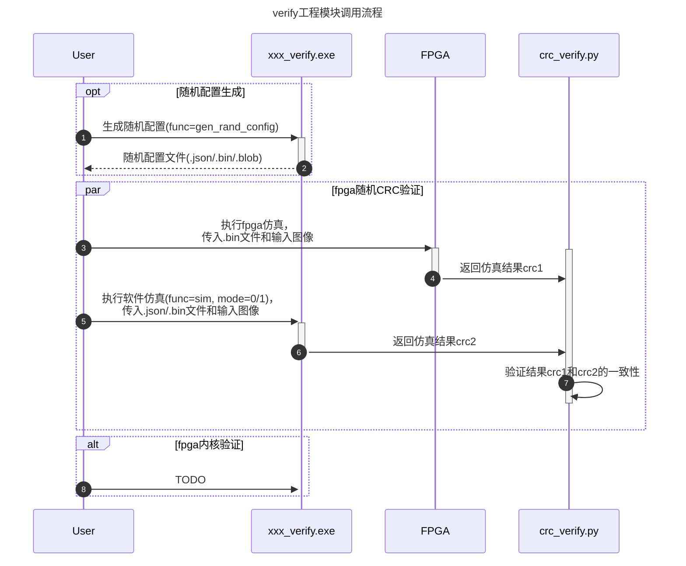

# FPGA 验证说明

## 1. 验证工程介绍

### 1.1 文件框架

### 1.2 模块



## 2. 验证流程

### 2.1. 环境准备

相关软件放于路径 `\\172.16.4.246\vop\3572_pq环境\fpag_software`
参考文件夹内`Marsvip S2800Hard平台使用说明.pdf`，安装FPGA开发板驱动、cygwin环境、ARMDS IDE等。

安装问题：

- `QuartusProProgrammer` 安装后 `JTAG` 驱动安装失败。
  1. 搜索驱动安装日志，一般是`C:\Windows\INF\setupapi.dev.log`，查看文件末尾部分的日志，找到和安装时间对应的部分日志信息。
  2. 将日志信息发给AI分析，可能会告诉你原因是: **​​证书过期​​** (0x800B0101) + **根证书不受信任​**(0x800B0109) + **Windows强制验证签名** 导致
  3. 解决办法之一是：[禁用驱动签名强制验证](https://zhuanlan.zhihu.com/p/622920268) ，之后再重新安装驱动。
  4. 重新安装驱动无需再安装一次`QuartusProProgrammer`，可以直接启动已解压好的驱动安装器： `xxx\intelFPGA_pro\20.1\qprogrammer\quartus\drivers\DPInst.exe`

- ArmDS 调试时提示`Unable to connect to New_configuration.`, `Licensed number of users already reached`的错误。
  - 系 license 同时使用数量达到上限，等待别人退出使用，或切换到其他网段.
  - `8224@172.16.11.206`
  - `8224@172.16.12.252`
  - `8224@172.16.13.206`

### 2.2. 寄存器对应功能熟悉

#### RK3572 VOP

:warning: 以下仅列出一些常用的或关键的寄存器

| 寄存器地址 | 寄存器名称 | bitfield内容 | 对应功能 |
| --------- | --------- | ------------ | -------- |
| 0x9F000000 | VOP_BASE |              | vop的寄存器基地址 |
| 0x9F000070 ~ 0x9F00008C | POST0_CTRL.POST_ACM_R2Y_CTRL ~ POST0_CTRL.POST_ACM_R2Y_OFFSET2 |  | 外层整体ACM R2Y系数 |
| 0x9F000CD0 ~ 0x9F000CEC | POST0_CTRL.POST_ACM_CTRL     ~ POST0_CTRL.POST_ACM_Y2R_OFFSET2 |  | 外层整体ACM Y2R系数 |
| 0x9F000CD0 | POST0_CTRL.POST_ACM_CTRL | acm_bypass_en <br> ... | 外层整体ACM Y2R控制和bypass控制 |
| 0x9F006400 ~ 0x9F006BD8 | ACM      |       | 内层ACM模块 |
| 0x9F006400 | ACM_CTRL | acm_en, acm_bypass <br> debug_en, debug_data_sel <br> acm_width, acm_height | ACM开关 <br> ACM debug开关 |
| 0x9F006404 | DELTA_RANGE |    | ACM三组LUT的gain值 |
| 0x9F006408 | FETCH_START |    | 对后续3组LUT赋值前需要将此设1 |
| 0x9F006410 ~ 0x9F00641C | DEBUG_POINT0_CFG ~ DEBUG_POINT3_CFG |  | 需要debug的4个像素位置 |
| 0x9F006420 | FETCH_DONE  |    | 对后续3组LUT赋值后需要将此设1 |
| 0x9F006430 ~ 0x9F00646C | DEBUG0_DATA0 ~ DEBUG3_DATA3 |  | 需要debug的4个像素的像素值 |
| 0x9F006500 ~ 0x9F006760 | YHS_GAIN_BY_Y_SEG0 ~ YHS_GAIN_BY_Y_SEG152 |  | y_gain表，9x17=153个  |
| 0x9F006764 ~ 0x9F006AD4 | YHS_GAIN_BY_S_SEG0 ~ YHS_GAIN_BY_S_SEG220 |  | s_gain表，13x17=221个 |
| 0x9F006AD8 ~ 0x9F006BD8 | YHS_DEL_BY_H_SEG0 ~ YHS_DEL_BY_H_SEG64    |  | delta表，65个 |

##### VOP Cluster layer

- **0x00001000** `CLUSTER0.WIN0_CTRL0.win0_data_fmt` 输入格式支持说明
  - `6'b00_0000 | 0x00`: ARGB888 - 32bit MSB ARGB, A高B低,
  - `6'b00_0001 | 0x01`: RGB888 - 24bit MSB RGB, R高B低
  - `6'b00_0010 | 0x02`: RGB565 - 16bit MSB RGB, R高B低
  - `6'b00_0011 | 0x03`: RGBA1010102 - 32bit MSB ARGB, R高A低
  - `6'b00_0100 | 0x04`: YCbCr420 - YUV420SP_NV21, 先V后U
  - `6'b00_0101 | 0x05`: YCbCr422 - YUV422SP_NV61, 先V后U
  - `6'b00_0110 | 0x06`: YCbCr444 - YUV444SP_NV42, 先V后U
  - `6'b00_0111 | 0x07`: YCbCr400 - Grayscale
  - `6'b01_0100 | 0x08`: YCbCr420_101010 - YUV420SP_NV15_VU, 先V后U, 10bit-packing
  - `6'b01_0101 | 0x09`: YCbCr422_101010 - YUV422SP_NV20_VU, 先V后U, 10bit-packing
  - `6'b01_0110 | 0x0A`: YCbCr444_101010 - YUV444SP_NV30_VU, 先V后U, 10bit-packing
  - `6'b01_0111 | 0x0B`: YCbCr400_101010 - Grayscale, 10bit-packing
  - `6'b00_1100 | 0x0C`: Tile4x4_YCbCr420
  - `6'b00_1101 | 0x0D`: Tile4x4_YCbCr422
  - `6'b00_1110 | 0x0E`: Tile4x4_YCbCr444
  - `6'b00_1111 | 0x0F`: Tile4x4_YCbCr400
  - `6'b01_1100 | 0x10`: Tile4x4_YCbCr420_101010
  - `6'b01_1101 | 0x11`: Tile4x4_YCbCr422_101010
  - `6'b01_1110 | 0x12`: Tile4x4_YCbCr444_101010
  - `6'b01_1111 | 0x13`: Tile4x4_YCbCr400_101010
- **0x00001000** `CLUSTER0.WIN0_CTRL0.win0_rb_swap`: 0-RGB, 1-BGR
- **0x00001000** `CLUSTER0.WIN0_CTRL0.win0_rg_swap`: RG交换？是否和`win0_rb_swap`互斥？
- **0x00001000** `CLUSTER0.WIN0_CTRL0.win0_uv_swap`: 0-YUV, 1-YVU
- **0x00001000** `CLUSTER0.WIN0_CTRL0.win0_yuv_clip`: 0-noClip, 1-ClipYuvBeforeY2R (Y-[16, 235], UV-[16, **239**]) 这个功能基本没用

### 2.3. Debug方法

#### CRC32 校验

- RGA的CRC开关寄存器: `0xf9000C40(POST0_CTRL.POST_SCL_CTRL.crc_en)`
- RGA的CRC值读取: `0xf9000C28(POST0_CTRL.POST_CRC_OUT)`
- 注意CRC的精度问题： CRC模块计算节点在POST之后，计算的数据精度受`POST0_CTRL.POST_DSP_CTRL.dsp_out_mode`影响。需要将其设为`0xF`才能保证是10bit精度

  ```c
      // enable CRC. POST0_CTRL.POST_SCL_CTRL.crc_en
      word32(VOPLITE_BASE + VOP3_POST0_CTRL_BASE + 0x40) = 0x0100;
      // dsp_out_mode set to 'Parallel 30-bit'. set this when checking CRC
      word32(VOPLITE_BASE + VOP3_POST0_CTRL_BASE + 0x00) |= 0x0F;
      // read CRC
      int crc = word32(VOPLITE_BASE + VOP3_POST0_CTRL_BASE + 0x28);
  ```

#### 利用 DEBUG_POINT 核对像素值

- 开关寄存器: `0x6400(ACM.ACM_CTRL.debug_en) |= 1<<2`
- 支持查看输入/输出和一些中间计算的结果，通过寄存器`(ACM.ACM_CTRL.debug_data_sel)`来切换要，具体种类包括:
  - `3'b000`: `((0<<3)|(1<<2)=0x04)` YUV in data
  - `3'b001`: `((1<<3)|(1<<2)=0x0c)` YUV2YHS data
  - `3'b010`: `((2<<3)|(1<<2)=0x14)` Interlation data
  - `3'b011`: `((3<<3)|(1<<2)=0x1c)` YUV out data
  - `3'b100`: `((4<<3)|(1<<2)=0x24)` Csc_out
  - `3'b101`: `((5<<3)|(1<<2)=0x2c)` Sharp_data
- 支持同时查看4个像素的像素值，设置 `0x6410(ACM.DEBUG_POINT0_CFG)` ~ `0x641C(ACM.DEBUG_POINT3_CFG)`
- 显示结果位于`0x6430(ACM.DEBUG0_DATA0)` ~ `0x646C(ACM.DEBUG3_DATA3)`
